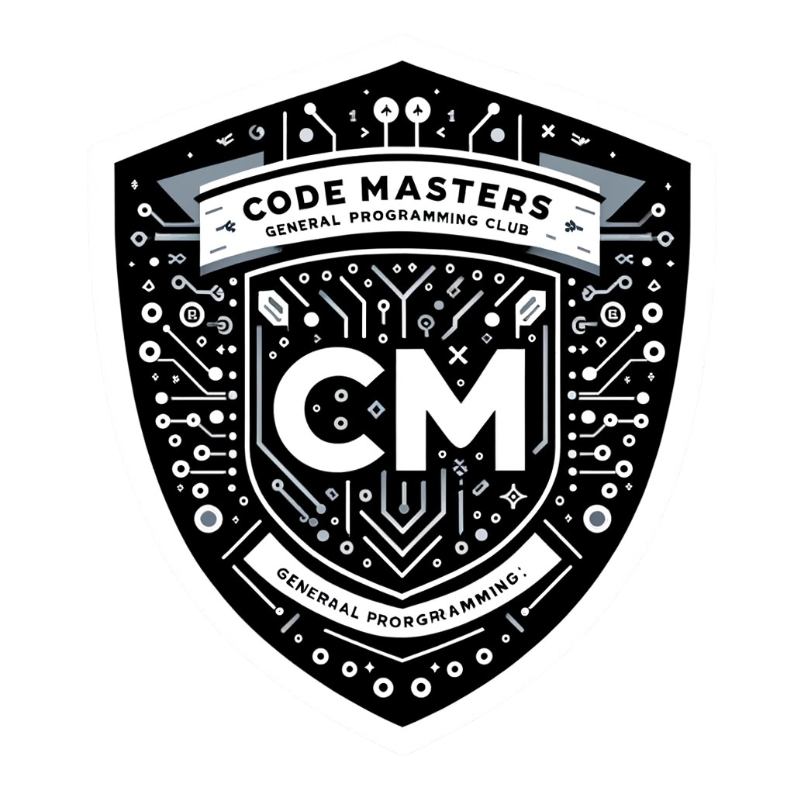

# CodeMasters2024

## Introducción a Python y Configuración del Entorno
- Conceptos básicos y configuración del entorno de desarrollo.
- Instalación de Python y familiarización con el intérprete.
- Introducción a Git y GitHub para el control de versiones.

## Conceptos Básicos de Programación en Python
- Variables, tipos de datos, operadores.
- Estructuras de control: if, for, while.

## Estructuras de Datos y Funciones en Python
- Listas, tuplas, diccionarios.
- Definición y uso de funciones.

## Introducción a la Programación Orientada a Objetos
- Conceptos de clases y objetos.
- Herencia y polimorfismo.

## Manejo de Excepciones y Módulos en Python
- Manejo de errores y excepciones.
- Importación y uso de módulos.

## Trabajando con Archivos y Directorios
- Lectura y escritura de archivos.
- Operaciones con directorios.

## Introducción a las Bases de Datos en Python
- Conexión a bases de datos SQL y NoSQL.
- Operaciones básicas de CRUD.

## Aplicaciones Web con Python
- Introducción a frameworks como Flask o Django.
- Creación de una pequeña aplicación web.

## Buenas Prácticas y Herramientas de Desarrollo
- Herramientas de debugging y testing.
- Buenas prácticas en programación y desarrollo de software.